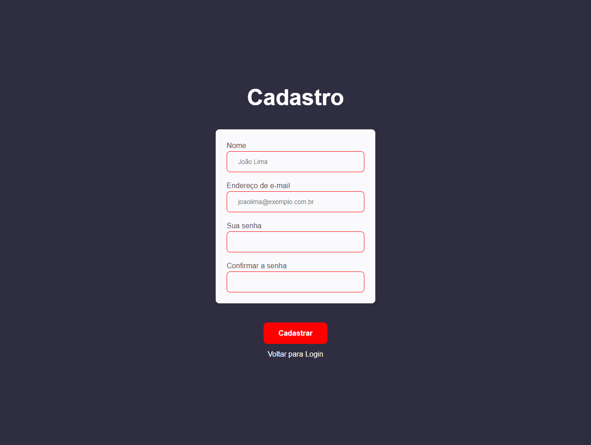

<h1 align="center">Processo Seletivo SENAI</h1>

Avaliação Técnica com banca examinadora

 

## Sistema de Login/Senha

 

  
   
  
   
  

 
 

## 🚀 Tecnologias

Esse projeto foi desenvolvido com as seguintes tecnologias:

- HTML
- CSS
- Javascript
- Node.JS
- mysql2
- sequelize
- phpmyadmin
- express
- express-session
- cors
- nodemon
- Git
- Github

## 💻 Projeto

O projeto era Elaborar um Plano de Aula e desenvolver um Sistema de Login, no Front-end e Back-end com conectividade ao Banco de Dados.

- Para mais esclarecimento do processo seletivo, o arquivo se encontra na pasta: .github 

## ✉️ [Contato](https://hugolino.dev)

hugolino2609@gmail.com
